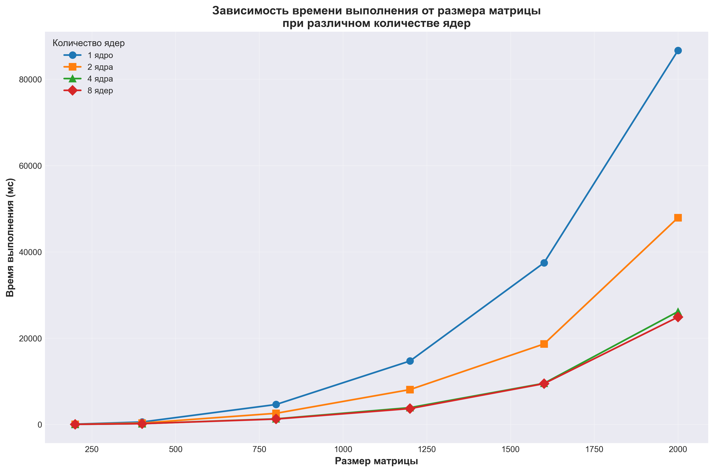

Характеристики моего ПК: 
| Поцессор | Intel Core Intel Core i7-5775C 3.30GHz |
| :---: | :---: |
| Оперативная память | 16ГБ |
| Операционная система | Windows 11, 64 битная |
| Видеокарта | NVIDIA GeForce GTX 1650 SUPER |

Результаты измерений:
| Размер матрицы/Количество ядер | 1 | 2 | 4 | 8 |
| :---: | :---: | :---: | :---: | :---: |
| 200x200 | 65.5 мс | 39.6 мс |  22.6 мс |  21.8 мс |
| 400x400 | 568.4 мс | 320.1 мс |  180.8 мс |  177.9 мс |
| 800x800 | 4619.9 мс |  2580.7 мс |  1296.3 мс |  1246.9 мс |
| 1200x1200 | 14707.3 мс |  8078.4 мс |  3897.3 мс |  3678.3 мс |
| 1600x1600 | 37450.4 мс |  18647.2 мс |  9532.6 мс |  9452.5 мс |
| 2000x2000 | 86650.7 мс |  47899.1 мс |  26144.4 мс |  24878.4 мс |

