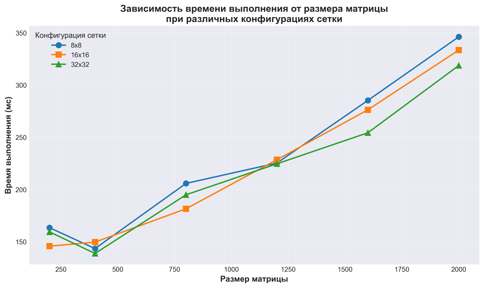

Характеристики моего ПК: 
| Поцессор | Intel Core Intel Core i7-5775C 3.30GHz |
| :---: | :---: |
| Оперативная память | 16ГБ |
| Операционная система | Windows 11, 64 битная |
| Видеокарта | NVIDIA GeForce GTX 1650 SUPER |

Результаты измерений:
| Размер матрицы/Конфигурация сетки | 8x8 | 16x16 | 32x32 |
| :---: | :---: | :---: | :---: |
| 200x200 | 163.4 мс | 145.7 мс |  159.4 мс |
| 400x400 | 143.4 мс | 149.6 мс |  138.7 мс |
| 800x800 | 205.8 мс |  181.5 мс |  194.9 мс |
| 1200x1200 | 225.3 мс |  228.5 мс |  224.6 мс |
| 1600x1600 | 285.3 мс |  276.3 мс |  254.3 мс |
| 2000x2000 | 346.2 мс |  333.5 мс |  318.7 мс |

