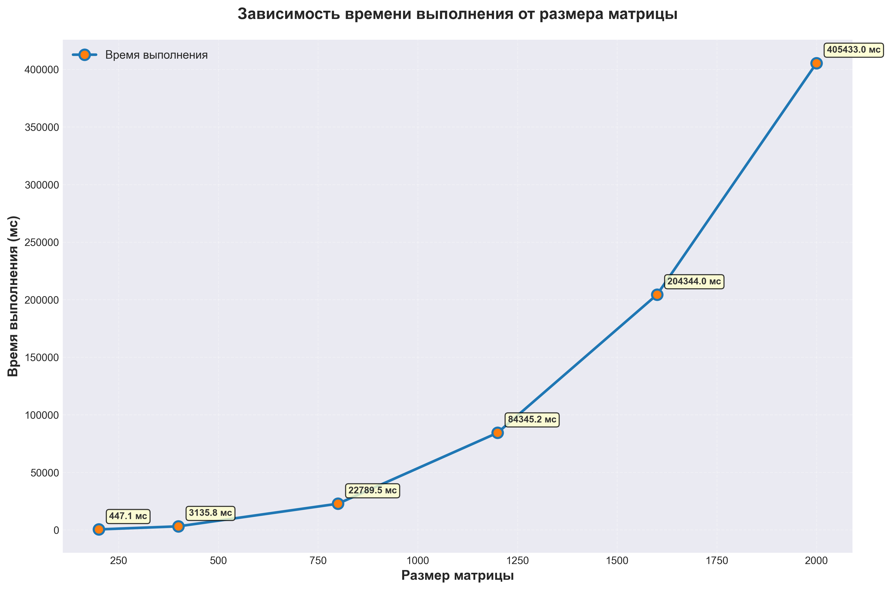

Характеристики моего ПК: 
| Поцессор | Intel Core Intel Core i7-5775C 3.30GHz |
| :---: | :---: |
| Оперативная память | 16ГБ |
| Операционная система | Windows 11, 64 битная |
| Видеокарта | NVIDIA GeForce GTX 1650 SUPER |

Результаты измерений:
| Размер матрицы | Время выполнения |
| :---: | :---: |
| 200x200 | 447.13 мс |
| 400x400 | 3135.84 мс |
| 800x800 | 22789.5 мс |
| 1200x1200 | 84345.2 мс |
| 1600x1600 | 204344 мс |
| 2000x2000 | 405433 мс |

