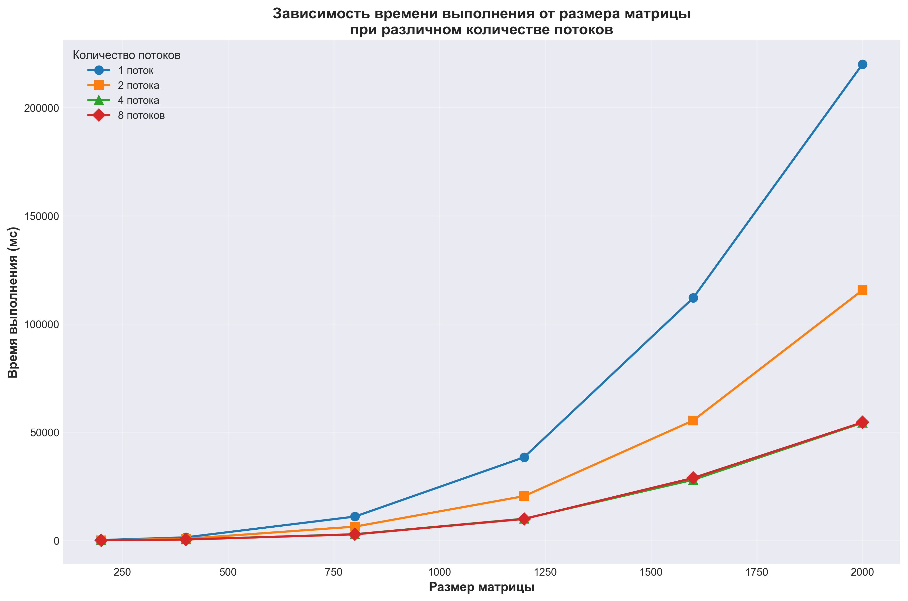

Характеристики моего ПК: 
| Поцессор | Intel Core Intel Core i7-5775C 3.30GHz |
| :---: | :---: |
| Оперативная память | 16ГБ |
| Операционная система | Windows 11, 64 битная |
| Видеокарта | NVIDIA GeForce GTX 1650 SUPER |

Результаты измерений:
| Размер матрицы/Количество потоков | 1 | 2 | 4 | 8 |
| :---: | :---: | :---: | :---: | :---: |
| 200x200 | 178.8.2 мс | 102.5 мс |  60.2 мс |  61.7 мс |
| 400x400 | 1437.5 мс | 768.5 мс |  400.5 мс |  443.3 мс |
| 800x800 | 11034.3 мс |  6400.4 мс |  2891.4 мс |  2820.7 мс |
| 1200x1200 | 38432.7 мс |  20479.7 мс |  10043.4 мс |  9930.5 мс |
| 1600x1600 | 112105.4 мс |  55450.2 мс |  28027.6 мс |  28894.2 мс |
| 2000x2000 | 220012.3 мс |  115644.5 мс |  54351.8 мс |  54560.6 мс |

